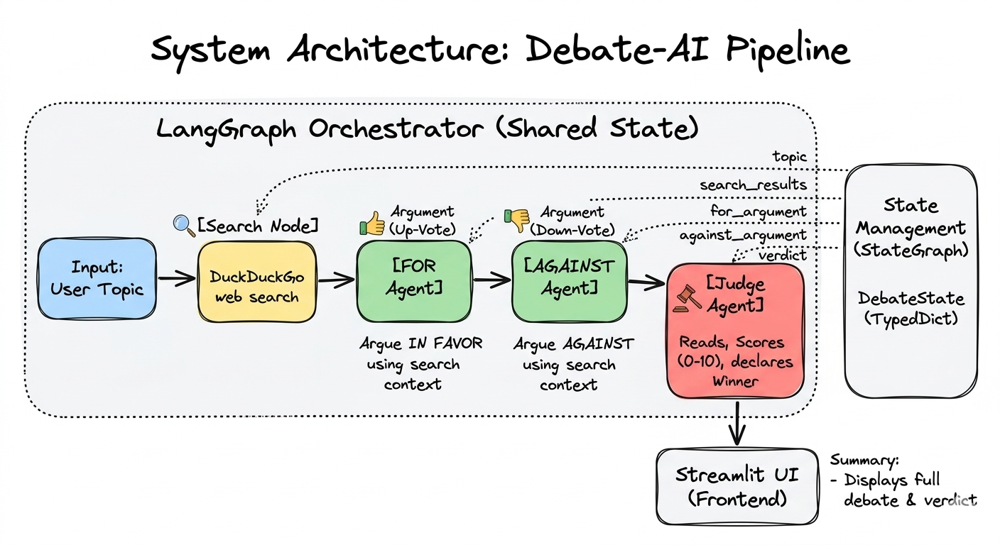

# ⚔️ Multi-Agent AI Debate Arena

Two AI agents argue opposite sides of any topic. A third judge AI scores both and declares a winner — all powered by a LangGraph pipeline with real-time web search.

🔗 **[Live Demo](https://sumanth-multi-agent-ai-debate-arena-3.streamlit.app)**

---

## How it works



---

## Tech Stack

| Tool | Purpose |
|------|---------|
| LangGraph | Agent orchestration & graph state management |
| Groq + Llama 3.3 70B | LLM inference (free tier) |
| LangChain | Agent & tool abstractions |
| DuckDuckGo Search | Free real-time web search |
| Streamlit | Frontend UI |

---

## Project Structure

```
├── app.py              # Streamlit UI
├── src/
│   ├── agents.py       # FOR / AGAINST / Judge agent logic
│   ├── graph.py        # LangGraph pipeline
│   ├── prompts.py      # System prompts for each agent
│   └── tools.py        # DuckDuckGo search tool
└── requirements.txt
```

---

## Run locally

```bash
git clone https://github.com/sumanth-msn/multi-agent-ai-debate-arena.git
cd multi-agent-ai-debate-arena

uv venv --python 3.12
source .venv/bin/activate

uv pip install -r requirements.txt
```

Add your Groq API key (free at [console.groq.com](https://console.groq.com)):
```bash
echo "GROQ_API_KEY=your_key_here" > .env
```

Run:
```bash
streamlit run app.py
```

---

## Why I built this

Most AI demos I've seen are just chatbots — one prompt, one response. I wanted to build something architecturally different.

**The idea:**
- Instead of one AI answering a question, what if two AIs disagreed with each other?
- And a third AI had to evaluate who argued better?

**The pattern behind it:**
- This is called the **agent-as-evaluator** pattern
- It's used in production for automated code review, content moderation, and LLM output quality testing
- Anthropic, OpenAI and other labs use variations of this in their own model evaluation pipelines

**Why I built it instead of just reading about it:**
- I wanted to actually implement `StateGraph` and understand how shared state flows between nodes
- I wanted to see if an LLM could genuinely evaluate another LLM's argument — and it can, surprisingly well
- Building it made the concept stick in a way no blog post could

---

## What I learned building this

- How to structure a multi-node agentic pipeline using LangGraph's `StateGraph`
- The **agent-as-evaluator** pattern — using one LLM to score and judge outputs of other LLMs
- Why grounding LLM responses with real search results reduces hallucination
- Managing shared state (`DebateState`) across independent agent nodes
- The difference between a single LLM with multiple prompts vs a true orchestrated multi-agent system

---

*Built by Sumanth · [GitHub](https://github.com/sumanth-msn)*